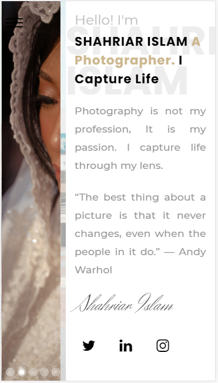

# Photography_portfolio

This is a HTML,Css and Javascript project. This is a portfolio website for a photographer to display his work. In this project I have used image carousel to display background images with timer. I have also incorporated aos library for scroll animation. I have used bootstrap for styling and font awesome for icons. This is a responsive website and suitable for desktop, tablet or mobile use.  

</h1>Additional description about the project and its features.</h1>

<h2>Built With</h2>

- Html
- CSS
- Javascript
- Bootstrap
- Font awesome
- AOS library
- Scss

<h2>Live Demo</h2>
https://shahriarislam.netlify.app/index.html

<h2>Getting Started</h2>
To get a local copy up and running follow these simple example steps.

Clone the repository and get the files in your local branch. Use it according
to your convenience.

Prerequisites
Text editor,Github profile and Git.

<h2>Authors</h2>

👤 Author1

Github: @ajkacca457

Twitter: @ajkacca

Linkedin: https://www.linkedin.com/in/avijit-karmaker-8738a54a/

🤝 Contributing
Contributions, issues and feature requests are welcome!

Feel free to check the issues page.

Show your support
Give a ⭐️ if you like this project!

📝 <h2>License</h2>
